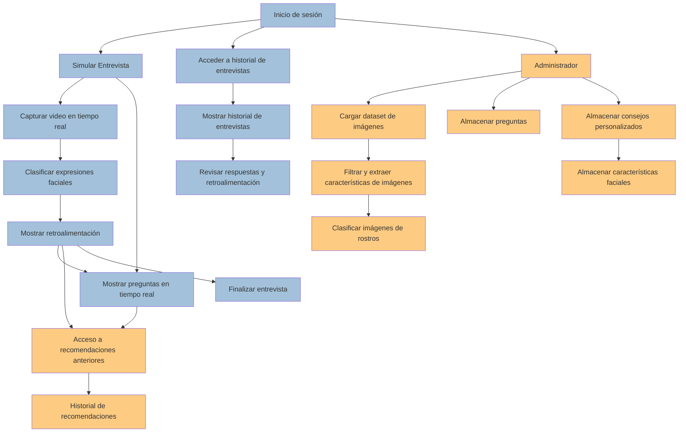

# Diagrama de caso de uso

```mermaid
graph TD
    A[Inicio de sesión] --> B[Simular Entrevista]
    A[Inicio de sesión] --> C[Acceder a historial de entrevistas]
    B --> D[Capturar video en tiempo real]
    D --> E[Clasificar expresiones faciales]
    E --> F[Mostrar retroalimentación]
    B --> G[Mostrar preguntas en tiempo real]
    F --> G
    C --> H[Mostrar historial de entrevistas]
    H --> I[Revisar respuestas y retroalimentación]
    A --> J[Administrador]
    J --> K[Cargar dataset de imágenes]
    J --> L[Almacenar preguntas]
    J --> M[Almacenar consejos personalizados]
    K --> N[Filtrar y extraer características de imágenes]
    N --> O[Clasificar imágenes de rostros]
    M --> P[Almacenar características faciales]
    F --> Q[Acceso a recomendaciones anteriores]
    G --> Q
    Q --> R[Historial de recomendaciones]
    F --> S[Finalizar entrevista]

    style A fill:#A3C1DA
    style B fill:#A3C1DA
    style C fill:#A3C1DA
    style D fill:#A3C1DA
    style E fill:#A3C1DA
    style F fill:#A3C1DA
    style G fill:#A3C1DA
    style H fill:#A3C1DA
    style I fill:#A3C1DA
    style J fill:#FDCB82
    style K fill:#FDCB82
    style L fill:#FDCB82
    style M fill:#FDCB82
    style N fill:#FDCB82
    style O fill:#FDCB82
    style P fill:#FDCB82
    style Q fill:#FDCB82
    style R fill:#FDCB82
    style S fill:#A3C1DA
```
